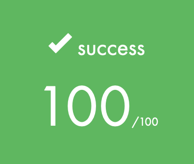
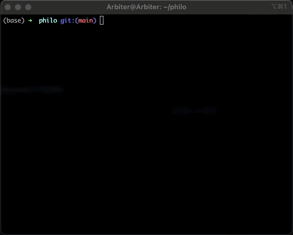

<div id="top"></div>

<!-- TABLE OF CONTENTS -->
<details>
  <summary>Table of Contents</summary>
  <ol>
    <li>
      <a href="#about-the-project">About The Project</a>
      <ul>
        <li><a href="#final-grade">Final grade</a></li>
      </ul>
    </li>
    <li>
      <a href="#getting-started">Getting Started</a>
    </li>
    <li><a href="#demo">Demo</a></li>
    <li><a href="#license">License</a></li>
    <li><a href="#contact">Contact</a></li>
  </ol>
</details>


<!-- ABOUT THE PROJECT -->
## About The Project

Solo project in school 21 (Ecole 42 franchise) about working with multithreading.

All src and header files compile via Makefile commands. Right now there is only one bonus feature and all mandatory ones.


<p align="right">(<a href="#top">back to top</a>)</p>


### Final grade: 100/100

 <br></br>

<p align="right">(<a href="#top">back to top</a>)</p>


<!-- GETTING STARTED -->
## Getting Started

First of all clone my repo with ```git clone```.

### Run it

Some steps how to run this minishell.
* run Makefile
  ```sh
  make 
  ```
* clean obj files
  ```sh
  make clean
  ```
* clean obj + binary
  ```sh
  make fclean
  ```
* fclean all
  ```sh
  make re
  ```


<p align="right">(<a href="#top">back to top</a>)</p>


<!-- DEMO -->
## Demo

 

<p align="right">(<a href="#top">back to top</a>)</p>


<!-- LICENSE -->
## License

Distributed under the MIT License. See `LICENSE.txt` for more information.

<p align="right">(<a href="#top">back to top</a>)</p>


<!-- CONTACT -->
## Contact

Ivan Surganov - [@isurganov](https://www.linkedin.com/in/ivansurganov/) - devsurganov@gmail.com

Project Link: [https://github.com/isurganov/philosophers](https://github.com/isurganov/philosophers)

<p align="right">(<a href="#top">back to top</a>)</p>


